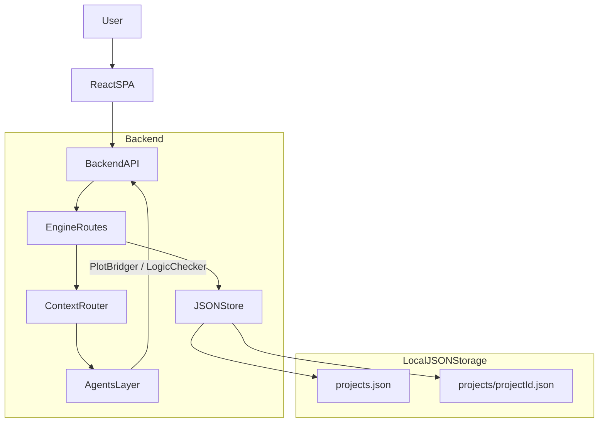

## 目标概述

- **核心目标**：基于本指南，实现一个数据驱动、上下文严格隔离的叙事引擎，包括：
  - **三层实体模型**：`Project` / `Context DB`（Character_DB, World_DB, Event_DB）/ `Storyline`。
  - **DB 版本管理**：类 Git 的版本号与冲突标记机制（不自动重写）。
  - **Context Router + Agent API**：用于调用 LLM 的 Bridger / Validator 路由（先留出 LLM 适配层）。
  - **前端界面**：纯 React SPA，用于管理 Project、编辑 Context DB、查看/管理 Storyline、触发 Agent 调用。
- **技术栈约定**：
  - **后端**：Node.js + TypeScript（Express/Fastify 级别简洁 HTTP 框架）。
  - **主数据存储**：**本地 JSON 文件存储**（`backend/data/`），便于查看、调试与快速验证；无需 Docker/MongoDB 即可运行。
  - **版本管理与迭代**：设计保留（见第三节），但当前实现暂未启用，后续再做。
  - **向量库**：Phase 1 不接入，结构化路由优先。
  - **前端**：Vite + React SPA。

---

## 一、项目整体结构设计

- **后端项目结构（例如 `backend/`）**：
  - `src/config/`：环境配置、全局常量（如版本号前缀策略）。
  - `src/storage/`：本地 JSON 存储层（`jsonStore.ts`）：项目列表、单项目数据（characters、worldRules、events、storylineNodes）的读写与隔离。
  - `src/services/`：
    - `projectService`：Project 层逻辑（隔离上下文）。
    - `contextDbService`：Character / World / Event 的业务逻辑。
    - `storylineService`：Storyline Node CRUD + 版本检查。
    - `versioningService`：统一处理 `DB_Version`、变更记录、冲突标记（**预留，当前未实现**）。
    - `contextRouterService`：根据请求拼装给 Agents 的 JSON payload。
  - `src/routes/`：HTTP API（REST 风格，后续可加 OpenAPI/Swagger）。
  - `src/agents/`：与 LLM API 对接的适配层（Agent A / B 的调用封装），Phase 1 可用 mock 或接口占位。
  - `src/app.ts` / `src/server.ts`：Express/Fastify 引导入口。
- **前端项目结构（例如 `frontend/`）**：
  - `src/api/`：封装调用后端 REST API 的客户端（含基础错误处理）。
  - `src/state/`：全局状态管理（如 Zustand 或 Redux Toolkit），用于缓存当前 Project、选中角色、当前 Storyline 等。
  - `src/components/`：可复用 UI 组件（表单、表格、布局组件等）。
  - `src/views/` 或 `src/pages/`：
    - Project 列表与详情视图。
    - Character / World / Event 的编辑视图。
    - Storyline 浏览与节点详情视图。
    - Agent 调用面板（Plot Bridger / Logic Checker）。
- **根目录**：
  - `backend/`, `frontend/`, `README.md`, `docker-compose.yml`（可选，未来集成 DB 容器），`package.json`（可拆分或 Monorepo）。

---

## 二、数据模型设计（本地 JSON 存储）

### 存储结构

- **`data/projects.json`**：项目列表 `[{ projectId, name, description }]`。
- **`data/projects/{projectId}.json`**：每个项目的完整数据，包含：
  - `characters`、`worldRules`、`events`、`storylineNodes` 数组。
  - 便于直接打开查看、备份与迁移。

### 1. Project 模型

- **字段建议**：
  - `projectId`: string（可读 ID / slug）。
  - `name`: string。
  - `description`: string。
  - `dbVersion`: number（**预留**，版本管理实现后启用）。
- **约束**：
  - 所有下级实体（Character, WorldRule, Event, StorylineNode）都必须携带 `projectId`，通过查询层面强制隔离。

### 2. Context DB 模型

- **Character_DB**（集合 `characters`）：
  - `projectId`: string。
  - `characterId`: string（如 `char_001`）。
  - `name`: string。
  - `coreTraits`: string[]。
  - `flaws`: string[]。
  - `motivations`: string[]。
  - `relationships`: 数组：
    - `targetId`, `relationType`, `knowledge`。
  - `meta`: 预留扩展字段（如标签、原型）。
- **World_DB**（集合 `world_rules`）：
  - `projectId`: string。
  - `ruleId`: string。
  - `category`: string。
  - `description`: string。
  - `strictnessLevel`: enum/string。
- **Event_DB**（集合 `events`）：
  - `projectId`: string。
  - `eventId`: string。
  - `timelineOrder`: number。
  - `title`: string。
  - `objectiveFacts`: string。
  - `involvedCharacterIds`: string[]。

### 3. Storyline 模型

- **StorylineNode**（集合 `storyline_nodes`）：
  - `projectId`: string。
  - `nodeId`: string。
  - `characterId`: string。
  - `eventId`: string。
  - `content`: string。
  - `versionHash`: string（与 DB 版本关系见下）。
  - `status`: enum：`"stable" | "needs_revision" | "draft"`。
  - `createdAt`, `updatedAt`。
- **可选 Storyline 集合**（如果你希望分组）：
  - `storylineId`, `characterId`, `title`, `nodeIds: string[]`。

---

## 三、DB 版本管理 & 变更追踪设计（**预留，当前未实现**）

> 版本管理、变更日志与 `needs_revision` 级联设计保留，后续实现时再接入。

### 1. 版本号与哈希策略

- **版本核心概念**：
  - 每个 `Project` 维护一个 `dbVersion` 整数。
  - 每次对 Context DB（Character, World, Event 任一）有结构性/语义性修改，即：
    - 新增 / 删除文档。
    - 修改关键字段（traits, world rules, objective facts 等）。
  - 时：
    - `dbVersion` 在 `Project` 上递增（例如 `1 -> 2`）。
- **StorylineNode.versionHash**：
  - 简化方案：直接存储其生成/通过逻辑检查时绑定的 `dbVersion`（例如 `v1`，内部实现为数字 1，展示为 `v1_abc123` 可选）。
  - 进阶方案：结合
    - `dbVersion`
    - 参与的 `characterId`、`eventId` 等，做一个短哈希（例如基于 JSON 序列化后做 `hash(characterSnapshot + worldRulesSnapshot + eventSnapshot)`）。

### 2. 变更日志表（可选但推荐）

- 新建集合 `db_change_logs`：
  - `projectId`。
  - `fromVersion`, `toVersion`。
  - `entityType`: `Character | WorldRule | Event`。
  - `entityIds`: string[]。
  - `changeSummary`: string（简要说明）。
  - `createdAt`。
- 这样可以：
  - 在前端列出某个版本升级涉及的实体。
  - 追踪后续 Storyline 冲突来源。

### 3. 冲突检测流程（符合文档的 Cascade Workflow）

- 当 Context DB 有更改：
  1. 在事务/操作完成后，`Project.dbVersion++`，记录 `db_change_logs`。
  2. 在同一个事务或后续 Job 中：
    - 查询所有关联 `entityIds` 的 `StorylineNode`，满足：
      - `node.projectId = currentProjectId`，且
      - `node.versionHash`（或 `dbVersionSnapshot`）小于当前 `dbVersion`，并涉及被改动的 `characterId` 或 `eventId` 等。
  3. 为这些 `StorylineNode` 标记：
    - `status = "needs_revision"`。
  4. 可选：为每个节点生成一条 `revision_task` 记录，前端列表友好展示。
- **注意**：系统只负责标记，不自动调用 LLM 重写，符合
  - “SYSTEM MUST NOT AUTO-REWRITE”。

---

## 四、Context Router & Agent API 设计

### 1. 路由职责与约束

- **Context Router**：
  - 只做数据聚合与 payload 构建，不直接访问 LLM。
  - 接收 HTTP 请求参数（如 `projectId`, `characterId`, `startEventId`, `endEventId`, `nodeId`）。
  - 从 `Context DB` 中抽取必要字段，拼成本节中定义的 JSON 格式。
- **Agent 调用层**：
  - 对接 LLM（OpenAI / Anthropic / Gemini），将 Router 产生的 payload 发给对应“系统 prompt + JSON schema”的 Agent。
  - 封装为 `agents/bridgerClient`、`agents/validatorClient`。

### 2. Bridger API（Agent A）

- **后端路由示例**：
  - `POST /api/projects/:projectId/bridger`
  - 请求体：
    - `characterId`, `startEventId`, `endEventId`，或 `nodeId`（对已有节点进行续写/扩写）。
  - 步骤：
    1. 校验 `projectId` 下这些实体是否存在。
    2. 读取 Character、World Rules（按相关性过滤或全量，Phase 1 可简单实现）、相关 Event（起始/结束或当前节点事件）。
    3. 通过 `contextRouterService` 拼 Bridger payload，格式严格符合本节 JSON 规范：
      - `task`
      - `character_context`
      - `world_context`
      - `start_event` / `end_event`（或当前事件）
      - 可选：现有 `content` 及来自 Validator 的 `feedback_from_validator`。
    4. 调用 `bridgerClient`（Phase 1 可 mock 返回固定结构），得到：
      - `bridging_steps: [{step, action}, ...]` 或直接 `draft_text`。
    5. 更新对应 Storyline Node 的 `content` 与状态（至少为 `draft`），并将结果返回给调用方。

### 3. Validator API（Agent B）

- **后端路由示例**：
  - `POST /api/projects/:projectId/validator`
  - 请求体：
    - `characterId`, 可选 `worldRuleIds`，以及 `textToVerify` 或 `nodeId`。
  - 步骤：
    1. 基于 `characterId`、`worldRuleIds` 汇总 traits 和 rules。
    2. 若传入 `nodeId`，从 DB 读取该 Storyline Node 的 `content` 作为 `textToVerify`（除非请求体中显式覆盖）。
    3. 通过 `contextRouterService` 拼 Validator payload（字段与本节 JSON 规范完全一致）。
    4. 调用 `validatorClient`（Phase 1 可 mock），获得：
      - `pass`, `violations[]`。
    5. 若传入 `nodeId`，可更新该 StorylineNode 的：
      - `status`（`pass = true` 时可标记为 `stable`，否则为 `needs_revision`），
      - `lastCheckResult` 字段。

---

## 五、前端交互设计（React SPA）

### 1. 核心页面/视图

- **Project 控制台**：
  - 列出所有 Project（名称、描述、当前 `dbVersion`）。
  - 可创建/删除/重命名 Project。
  - 选择 Project 后进入其详情工作区。
- **Context DB 编辑区**：
  - Tab 或侧边栏分为：Characters / World Rules / Events。
  - 列表 + 详情表单：
    - 可增删改字段（traits、motivation 等）。
    - 保存后显示当前 Project 的 `dbVersion` 变化与变更摘要。
- **Storyline 视图**：
  - 按 `characterId` + 时间顺序查看 Storyline 节点。
  - 节点列表上高亮：
    - `needs_revision`（红/橙色标记）。
  - 点击节点：
    - 显示 `content`，`versionHash` / `dbVersionSnapshot`，最近的 Logic Checker 结果。
- **Agent 操作面板**：
  - 针对选中角色 + 事件范围：
    - 调用 Plot Bridger 获取 bridging steps，并在 UI 中展示为“建议步骤列表”。
  - 针对某个 Storyline 节点的文本：
    - 调用 Logic Checker，结果以“通过/不通过 + 违规列表”的方式列表展示。

### 2. UI / UX 基本要求

- 左侧导航：Project 选择 + 上下文数据（Characters / World / Events / Storyline / Agents）。
- 中间主工作区：
  - 列表 + 表单 / 编辑区域。
- 右侧信息栏（可选）：展示当前选中实体的元信息、关联 Storyline 节点、版本信息等。
- 使用组件库（可选）：Ant Design / MUI / Chakra 等，以提高迭代速度。

---

## 六、数据存储与备份策略

### 1. 本地 JSON 存储

- **目录结构**：
  - `backend/data/projects.json`：项目列表。
  - `backend/data/projects/{projectId}.json`：单项目数据。
- **环境变量**（可选）：
  - `DATA_DIR`：数据目录路径，默认 `backend/data`。
- **备份**：直接复制 `data/` 目录即可；单项目 JSON 可单独导出/导入。

### 2. 环境与备份策略（适配 solo-dev）

- 本地开发：
  - 无需 Docker/MongoDB，直接 `cd backend && npm run dev` 即可启动。
  - 数据文件可直接打开查看、编辑。
- 简单云部署：
  - 可将 `data/` 挂载到持久化卷；或后续迁移到 MongoDB/PostgreSQL 等。

---

## 七、Phase 1 实现步骤拆分

1. **初始化项目骨架**：
  - 建立 `backend/` TypeScript + Express/Fastify 脚手架。
  - 建立 `frontend/` Vite + React 项目。
  - 在根目录配置基础 README 与工作流说明。
2. **实现本地 JSON 存储**：
  - 实现 `backend/src/storage/jsonStore.ts`：项目列表与单项目数据读写。
  - 定义 Project / Character / WorldRule / Event / StorylineNode 类型（`storage/types.ts`）。
3. **实现基础 CRUD API**：
  - Project CRUD。
  - Character / WorldRule / Event CRUD。
  - StorylineNode CRUD（含 `status`、`lastCheckResult`）。
4. **实现版本管理逻辑**（**预留**）：
  - 封装 `versioningService`：
    - 统一入口：当 Context DB 写操作发生时，调用 `incrementDbVersionAndLogChanges()`。
    - 根据变更查找关联 StorylineNode 并标记 `needs_revision`。
5. **实现 Context Router 与 Agent API 占位**：
  - 建立 `/plot-bridger` 和 `/logic-checker` 后端路由。
  - 实现 Router 组装逻辑，payload 结构完全遵守 `Project_Guidance.md`。
  - Phase 1 中 Agent 调用层可返回 mock 数据，但保留 LLM 调用接口位置与 JSON output 校验逻辑。
6. **搭建前端基础页面**：
  - Project 控制台视图。
  - Context DB 编辑页面（Characters / World / Events）。
  - Storyline 浏览页面（节点状态颜色区分）。
7. **集成 Agent 调用到前端**：
  - 在 Storyline 视图中：
    - 为节点添加“逻辑检查”按钮，展示结果与状态更新。
  - 在某个角色 + 起始/结束事件选择视图中：
    - 调用 Plot Bridger，展示 bridging steps。
8. **文档与示例 Project**：
  - 在 README 中展示：
    - 数据模型简图。
    - 典型工作流（编辑世界观 -> 升级版本 -> 标记 Storyline 冲突 -> 手动修复）。
  - 提供一个 Demo Project（包含一个角色 Elias、若干 world rules 与 events）。

---

## 八、简要架构图（Mermaid）

